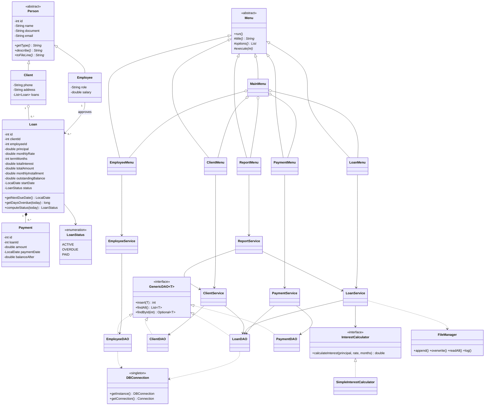

# CrediYa - UML Class Diagram

## Layers
`view` (menus) -> `service` (business rules) -> `dao` (JDBC / SQL) -> MySQL.
`model` is shared by all layers; `util` has the Singleton connection, text-file manager and input helpers.
